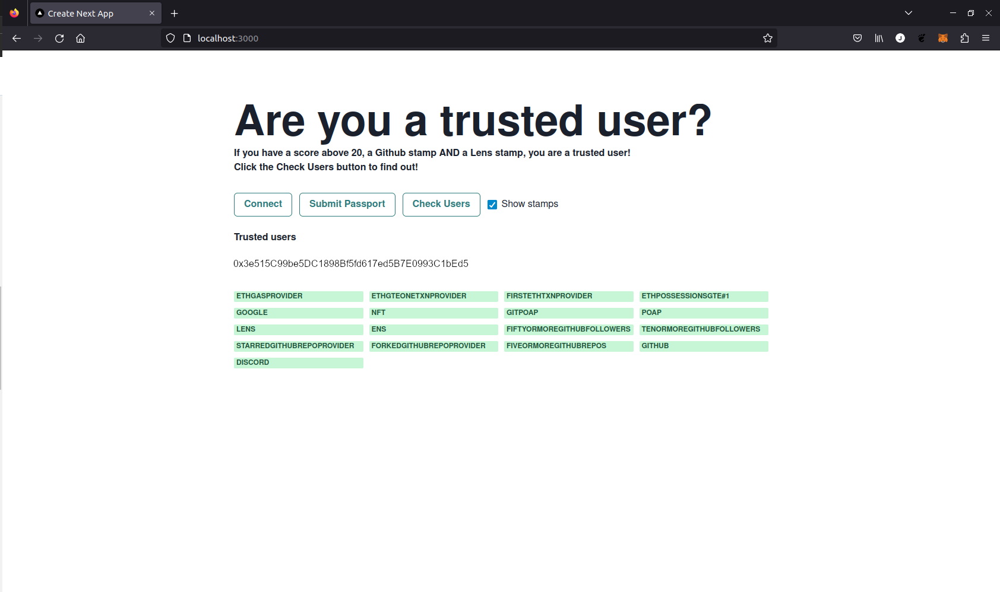

# Reading Passport stamps

Gitcoin Passport can be used to automatically gate applications, but it can also be used as a powerful tool for supporting human decision makers. Instead of blocking access using a score threshold, Gitcoin Passport can display a user's scores and stamps. This can provide critical information to human managers that need to allocate some funds, roles, responsibilities or access to the right person at the right time. In contrast to simple threshold-gating that is executed automatically and entirely defined in code, this approach aims to provide granular data to enable humans to make better-informed decisions.

## Why would you want a scorer integration?

A great example is [Coordinape](https://coordinape.com/). Coordinape is a widely used platform for allocating funds to team members thast are connected in a "circle". The circle is funded with a certain budget, and the funds are later distributed to the partipants according to the number of reward tokens they are allocated by other members of the team. You come together to perform some task and later allocate tokens to each other to determine how the funds are released.

However, there have been examples of impersonators joining circles, pretending to be one of the legitimate contributors and getting allocated tokens. This is a way attackers can steal from honest participants. Without some additional information, it is hard to know that you are allocating tokens to a real contributor and not an impersonator.

A Gitcoin Passport scorer integration is a solution to this problem. By showing the Passport score and list of stamps for each user in the app, it is easier to identify the honest participant from their dishonest double. When faced with two instances of one contributor that you want to allocate tokens to, you might check to see which one has a certain community-specific stamp in their Passport as evidence that they are the real team member. 

Note, however, that it is possible for someone to be an impersonator and *also* have a high Passport score. This is why a scorer integration is more about giving additional evidence, or context, to choices than it is about automated, binary decision making.

Let's see how an integration like this is built using the Passport Scorer API...

## Integrating a scorer

### Setting up a basic app

In the Quick Start guide we walk through how to set up a Next.js app and add some basic functions for integrating Gitcoin passport. We won't cover all those steps again here, but you can always refer back there to clarify how to get started using `create-next-app`.

This tutorial assumes you have a new create-next-app ready to go.

### Create your API key and Scorer

1. Create your API key by going to [Gitcoin Passport Scorer](https://scorer.gitcoin.co) and clicking on the "API Keys" section.


2. Then create a `.env.local` file in your app's project directory and copy the following content, replacing `<YOUR-SCORER_API_KEY>` with your API key and `<YOUR-SCORER-ID>` with your scorer ID.

```
NEXT_PUBLIC_GC_API_KEY = <YOUR-SCORER-API-KEY>
NEXT_PUBLIC_GC_SCORER_ID = <YOUR-SCORER-ID> 
```

Replace the contents of `app/page.tsx` with the following boilderplate code (this includes all the very basic logic to render a page and connect a wallet to the app, but none of the logic required to check a user passport - we will add this step by step in this tutorial):

```tsx
'use client'
import { useState, useEffect } from 'react'
import { ethers } from 'ethers'

const APIKEY = process.env.NEXT_PUBLIC_GC_API_KEY
const SCORERID = process.env.NEXT_PUBLIC_GC_SCORER_ID

// endpoint for submitting passport
const SUBMIT_PASSPORT_URI = 'https://api.scorer.gitcoin.co/registry/submit-passport'
// endpoint for getting the signing message
const SIGNING_MESSAGE_URI = 'https://api.scorer.gitcoin.co/registry/signing-message'
// score needed to see hidden message
const thresholdNumber = 20
const headers = APIKEY ? ({
  'Content-Type': 'application/json',
  'X-API-Key': APIKEY
}) : undefined

declare global {
  interface Window {
    ethereum?: any
  }
}

export default function Passport() {
  // here we deal with any local state we need to manage
  const [address, setAddress] = useState<string>('')

  useEffect(() => {
    checkConnection()
    async function checkConnection() {
      try {
        const provider = new ethers.BrowserProvider(window.ethereum)
        const accounts = await provider.listAccounts()
        // if the user is connected, set their account
        if (accounts && accounts[0]) {
          setAddress(accounts[0].address)
        }
      } catch (err) {
        console.log('not connected...')
      }
    }
  }, [])

  async function connect() {
    console.log("in connect func")
    try {
      const accounts = await window.ethereum.request({ method: 'eth_requestAccounts' })
      setAddress(accounts[0])
    } catch (err) {
      console.log('error connecting...')
    }
  }

  async function getSigningMessage() {
    try {
      const response = await fetch(SIGNING_MESSAGE_URI, {
        headers
      })
      const json = await response.json()
      return json
    } catch (err) {
      console.log('error: ', err)
    }
  }

  async function submitPassport() {
    try {
      // call the API to get the signing message and the nonce
      const { message, nonce } = await getSigningMessage()
      const provider = new ethers.BrowserProvider(window.ethereum)
      const signer = await provider.getSigner()
      // ask the user to sign the message
      const signature = await signer.signMessage(message)
      // call the API, sending the signing message, the signature, and the nonce
      const response = await fetch(SUBMIT_PASSPORT_URI, {
        method: 'POST',
        headers,
        body: JSON.stringify({
          address,
          scorer_id: SCORERID,
          signature,
          nonce
        })
      })

      const data = await response.json()
      console.log('data:', data)
    } catch (err) {
      console.log('error: ', err)
    }
  }

  const styles = {
    main: {
      width: '900px',
      margin: '0 auto',
      paddingTop: 90
    },
    heading: {
      fontSize: 60
    },
    intro: {
      fontSize: 18,
      color: 'rgba(0, 0, 0, .55)'
    },
    configurePassport: {
      marginTop: 20,
    },
    linkStyle: {
      color: '#008aff'
    },
    buttonContainer: {
      marginTop: 20
    },
    buttonStyle: {
      padding: '10px 30px',
      outline: 'none',
      border: 'none',
      cursor: 'pointer',
      marginRight: '10px',
      borderBottom: '2px solid rgba(0, 0, 0, .2)',
      borderRight: '2px solid rgba(0, 0, 0, .2)'
    },
    hiddenMessageContainer: {
      marginTop: 15
    },
    noScoreMessage: {
      marginTop: 20
    }
  }

  return (
    /* this is the UI for the app */
    <div style={styles.main}>
      <h1 style={styles.heading}>Are you a trusted user? 🫶</h1>
      <p style={styles.configurePassport}>Configure your passport <a style={styles.linkStyle} target="_blank" href="https://passport.gitcoin.co/#/dashboard">here</a></p>
      <p style={styles.configurePassport}>Once you've added more stamps to your passport, submit your passport again to recalculate your score.</p>
      <p style={styles.configurePassport}>If you have a score above 20, a Github stamp AND a Lens stamp, you are a trusted user! Click the Check Users button to find out!</p>
      <div style={styles.buttonContainer}>
        <div style={styles.buttonContainer}>
          <button style={styles.buttonStyle} onClick={connect}>Connect</button>
          <button style={styles.buttonStyle} onClick={submitPassport}>Submit Passport</button>
        </div>
      </div>
    </div>
  )
}
```


### Checking a Passport

The [Quick Start guide](quick-start.md) walks you through the basic imports and configuration required to build an app using `create-next-app`. It shows how to write functions for connecting a Passport to an application, checking the connection, submitting user Passports to the registry and checking a user's score. 

In thsi tutorial you will learn how to create a more advanced scorer integration that will determine whether connected users are trusted or untrusted according to a combination of their score and ownership of specific stamps. The boilerplate code already provides buttons the users can click to connect their wallet and submit their Passport to the registry. We won't cover these functions again in this tutorial, so please note that a wallet connection and submitted Passport are required for calls to the Scorer API to return useful responses.

#### Retrieving a score

We want to display a user's trust status in the app's UI. Their trust status will be determined by their Passport score and ownership of specific stamps. The first step is to retrieve their Passport score by calling the `/registry/score/${SCORER_ID}/${address}` API endpoint. The following function requests a user's Passport score from that endpoint. If no score exists it prints a warning to the console.


```tsx
  async function getPassportScore(currentAddress: string) {
    console.log("in getScore()")
    const GET_PASSPORT_SCORE_URI = `https://api.scorer.gitcoin.co/registry/score/${SCORERID}/${currentAddress}`
    try {
      const response = await fetch(GET_PASSPORT_SCORE_URI, {
        headers
      })
      const passportData = await response.json()
      if (passportData.score) {
        // if the user has a score, round it and set it in the local state
        const roundedScore = Math.round(passportData.score * 100) / 100
        return roundedScore
      } else {
        // if the user has no score, display a message letting them know to submit thier passporta
        console.log('No score available, please add stamps to your passport and then resubmit.')
      }
    } catch (err) {
      console.log('error: ', err)
    }
  }
```

#### Retrieving stamps

Next we want to retrieve the user's stamps by calling the `/registry/stamps` API endpoint. The following function requests a user's Passport stamp data from that endpoint and prints it to the console. If no score exists it prints a warning to the console.


```tsx
  async function getPassportStamps(currentAddress: string) {
    console.log("in getStamps()")
    const stampProviderArray = []
    const GET_PASSPORT_STAMPS_URI = `https://api.scorer.gitcoin.co/registry/stamps/${currentAddress}`
    try {
      const response: Response = await fetch(GET_PASSPORT_STAMPS_URI, { headers })
      const data = await response.json()
      console.log(data)
    } catch (err) {
      console.log('error: ', err)
    }
  }
```
We can invoke the function on the click of a button by adding the following to the UI:

```html
<button style={styles.buttonStyle} onClick={() => getPassportStamps({address})}>Check Stamps</button>
```

If we run the app using `npm run dev`, connect a wallet that has some stamps and click the `Check Stamps` button, the following object will be displayed in the console. In this example there are 33 credentials in the array, with one expanded as an example - the length of the `items` aray will depend upon how many verified credentials the Passport owns.

```
stamp data: 
Object { next: null, prev: null, items: (33) […] }
  items: Array(33) [ {…}, {…}, {…}, … ]
    0: Object { version: "1.0.0", credential: {…} 
      credential: Object { issuer: "did:key:z6MkghvGHLobLEdj1bgRLhS4LPGJAvbMA1tn2zcRyqmYU5LC", issuanceDate: "2023-04-20T13:21:38.948Z", expirationDate: "2023-07-19T13:21:38.948Z", … }
        "@context": Array [ "https://www.w3.org/2018/credentials/v1" ]
        credentialSubject: Object { id: "did:pkh:eip155:1:0x1D4098C948Dc41958Bf3A745deC77AE059C3aDF6", hash: "v0.0.0:kWgm+E06OQrSk0M9NcEI3il5FIs9UoJQP3geH4LBuoY=", provider: "Google", … }
        expirationDate: "2023-07-19T13:21:38.948Z"
        issuanceDate: "2023-04-20T13:21:38.948Z"
        issuer: "did:key:z6MkghvGHLobLEdj1bgRLhS4LPGJAvbMA1tn2zcRyqmYU5LC"
        proof: Object { jws: "eyJhbGciOiJFZERTQSIsImNyaXQiOlsiYjY0Il0sImI2NCI6ZmFsc2V9..sgcMRAONRMo7TfTgmMPgvfaP_MOzyiXcErIsIKap-nNpOuTNGSkhTdgxWFl5Mp6ueYnmcRDkgxBiDNCMmS5GDA", type: "Ed25519Signature2018", created: "2023-04-20T13:21:38.948Z", … }
        type: Array [ "VerifiableCredential" ]
        <prototype>: Object { … }
        version: "1.0.0"
<prototype>: Object { … }
1: Object { version: "1.0.0", credential: {…} }
2: Object { version: "1.0.0", credential: {…} }
3: Object { version: "1.0.0", credential: {…} }
4: Object { version: "1.0.0", credential: {…} }
5: Object { version: "1.0.0", credential: {…} }
...
next: null
prev: null
<prototype>: Object { … }
```

Printing this object to the console isn't particularly useful to us, but seeing the object structure in this way demonstrates that the API call is working correctly and gives us information we cna use to parse the stamp data effectively.


#### Handling stamp data

There is a lot of information contained in the object returned from `registry/stamps` - for most use-cases only a subset of the data is useful. We might, for example, only be interested in the stamp `provider`, and not the granular details of the credential expiry, proof etc. We can parse this information out of each item in the array. 

Let's just try to parse out the useful information first. We'll do this in a separate function, so let's replace our `console.log()` statement with a some simple code that parses out the `provider` for each of the user's stamps as a `string` and adds it to an `Array`. We'll print this array to the console to check we only have the `provider` strings.

```tsx
async function getPassportStamps(currentAddress: string) {
  console.log("in getStamps()")
  const stampProviderArray = []
  const GET_PASSPORT_STAMPS_URI = `https://api.scorer.gitcoin.co/registry/stamps/${currentAddress}`
  try {
    const response: Response = await fetch(GET_PASSPORT_STAMPS_URI, { headers })
    const data = await response.json()
    // parse stamp data from json
    for (const i of data.items) {
      stampProviderArray.push(i.credential.credentialSubject.provider)
    }
    console.log(stampProviderArray)
  } catch (err) {
    console.log('error: ', err)
  }
}
```

Clicking the `Check Stamps` button will now display the following in the console:

```
  stampProviders: Array(33) [ "Google", "NFT", "GitPOAP", … ]
    0: "Google"
    1: "NFT"
    2: "GitPOAP"
    3: "POAP"
    4: "Lens"
    5: "Ens"
    6: "FiftyOrMoreGithubFollowers"
    7: "TenOrMoreGithubFollowers"
    8: "StarredGithubRepoProvider"
    9: "ForkedGithubRepoProvider"
    10: "FiveOrMoreGithubRepos"
    11: "Github"
    12: "Discord"
    13: "EthGasProvider"
    ...
```

Now, for out actual app we want to return the array to use elsewhere instead of just printing it to the console, so we can replace `console.log(stampProviderArray)` with `return stampProviderArray`.


### Tracking the stamps and score in state

The two functions, `getPassportScore()` and `getPassportStamps` return data that we want to keep track of in our app so that we can use it to make decisions about the trustworthiness of a user. This means we need a way to track these data in the app's state and functions that access that state to make some calculations.

We can start by wrapping the two functions in an outer `checkpassport()` function that calls both `getPassportScore()` and `getPassportStamps`:

```tsx
  async function checkPassport(currentAddress = address) {
    let score: number = await getPassportScore(currentAddress) as number
    let stampProviders = await getPassportStamps(currentAddress) as Array<string>
  }
```

Instead of creating lots of state variables for each user, we can define an interface that can hold all the relevant information we want to track about each user. Add the following interface to the boilerplate code outside of the `Passport()` function:

```tsx
interface UserStruct {
  id: number;
  address: string;
  score: number;
  stampProviders: Array<String>;
}
```
The `UserStruct` interface has fields for the user's address, score and stamp providers as well as a unique identifier. In our `checkPassport()` function, we can pass the responses from `getPassportScore()` and `getPassportStamps()` into a new instance of `UserStruct`. We can then add each instance to a state variable array. First, add a state variable `userInfo` as an array that will take instances of UserStruct.

```tsx
const [userInfo, setUserInfo] = useState<Array<UserStruct>>([])
```

Now, we can update `checkPassport()` to create a new `UserStruct` from the values returned from the Passport API calls, plus the user address and a unique ID calculated by adding 1 to the current length of the `UserInfo` array. This new `UserStruct` is added to the `UserInfo` array using the `setUserInfo` method.

```tsx
async function checkPassport(currentAddress = address) {
  let score: number = await getPassportScore(currentAddress) as number
  let stampProviders = await getPassportStamps(currentAddress) as Array<string>
  const id = userInfo.length + 1
  let user: UserStruct = { id: id, address: currentAddress, score: score, stampProviders: stampProviders }
  setUserInfo(userInfo.concat(user))
}
```

Now each user's stamps and score are tracked in custom structs in our application's state.

#### Using the stamp and score data

Now we can use the state data to make decisions about each user. Maybe we just want a quick way to tell  whether a connected user meets some specific requirements. Let's create a simple example where we display a list of connected addresses that are trusted because their passport meets some requirements. This means the users of our app can see a real-time list of addresses that meet the eligibility criteria and can use this to help pick out the honest users.

Let's set some arbitrary requirements. If the user has owns a Lens stamp **and** and ENS stamp **and** a Github stamp, **and** their Passport score is greater than 20, then they are considered trusted and their address is displayed On the screen. 

So far, we have set up a state variable to collect all the connected users. We want a subset of those users that meet our eligibility requirements. We can achieve this by calling `filter` on the `UserInfo` array. We'll filter on our trust criteria by checking the `stampProviders` and `score` fields of each `UserStruct` in `UserInfo` and return the filered array.

```tsx
function checkTrustedUsers() {
  return userInfo.filter(
    user => user.stampProviders.includes('Lens')
      && (user.stampProviders.includes("Github"))
      && (user.score > 20))
}
```

We can now keep track of this filtered array in our app's state too. Create a new state variable, `TrustedUsers`. It's type should be an array of `UserStruct`s.

```tsx
const [trustedUsers, setTrustedUsers] = useState<Array<UserStruct>>([])
```
Now we can update the app's state by passing `checkTrustedUsers()` to `setTrustedUsers()`.

```tsx
setTrustedUsers(checkTrustedUsers())
```

### Displaying trusted users in the UI

For our demo app, we simply want to display the trusted users in the UI. In real world applications the user data might be used in more complex ways. For example, you might build in a small warning pop up when you call some function passing an address that does not appear in `TrustedUsers`. 

Let's just add a button that will toggle displayign the trusted users on or off.

We'll create a small function that sets a `boolean` to control the display that will be part of the app's state.

Add the new state variable, initialized to `false`:
```tsx
const [showTrusted, setShowTrusted] = useState<boolean>(false)
```

Now add `updateShowTrusted` that resets `Trustedusers` and sets ShowTrusted to `true`.

```tsx
const updateShowTrusted = () => {
  setTrustedUsers(checkTrustedUsers())
  if (showTrusted === false) {
    setShowTrusted(true)
  } else {
    setShowTrusted(false)
  }
}
```

Now, in our UI, we can add a button that calls this function. Add the following button immediately below the two existing buttons in the UI: 

```tsx
<button style={styles.buttonStyle} onClick={updateShowTrusted}>Check Users</button>
```

And finally, to actually render the information to the browser, add the following code. If `showTrusted` evaluates to `true` the app will render the results of :

```tsx
<div>
  <br></br>
  {showTrusted && trustedUsers.map(user => user.address) && " is a trusted user"}
</div>
```



## Summary

OK! Now we have a simple app that allows users to connect their wallets and trusted addresses that meet the score and stamp criteria are displayed in the browser! Of course the app we created here has the bare minimum functionality required to demonstrate score and stamp management, but the concepts explained here can be used to create more complex apps that use the stamp and score criteria to support human decision making or more complex automated processes.


