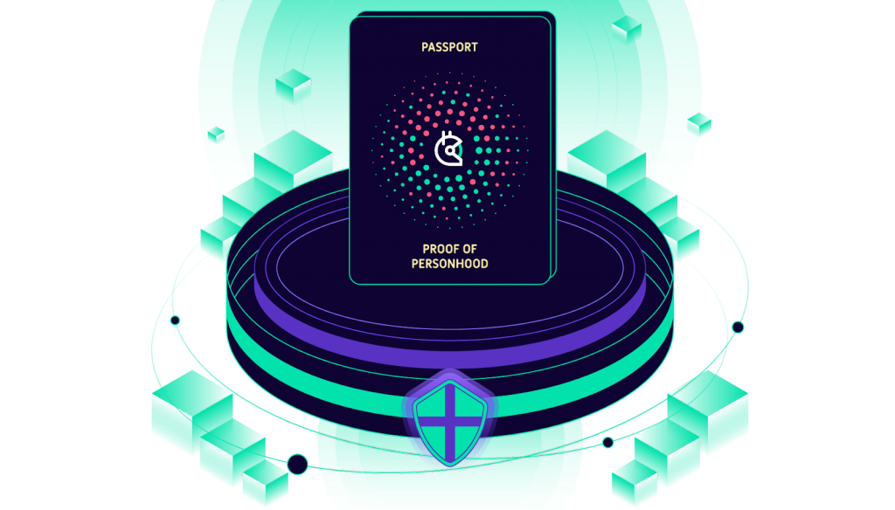

# Introduction

At Gitcoin, we believe that digital identity is a public good. To coordinate and scale an open internet, we need tools that will enable successful and trustworthy collective decision-making–without worrying about bots and bad actors extracting from our communities.

One of the biggest promises and paradoxes of blockchain technology is that it allows deeper connections between members of online collectives at scale while also protecting user privacy. Genuine community control over platforms and online communities through an on-chain voting and communally governed funds are now possible. However, many emerging applications assume that every participant is who they say they are and is acting in good faith. 

How can we build and verify digital reputation without sacrificing user privacy? 

The Gitcoin community has built a tool to do just that: Gitcoin Passport, your citizenship pass for the decentralized internet. 

Gitcoin Passport is a sybil resistance protocol and identity aggregation dApp built on the Ceramic Network. Users can collect various identity attestations, called "stamps", from web2 and web3 authenticators all in one place.
 
  

## Navigating these docs

Explore the docs using the navigation menu on the left side of the screen. These docs are designed to serve two specific user personas: **users** and **developers**. 

You are a user is you want to use Gitcoin passport to prove your trustworthiness when you interact with apps. 

You are a developer if you want to integrate Gitcoin passport into the apps you are building. Whichever persona you align with, we have a section especially for you.

Our **user** docs are divided into two sections: `concepts` and `guides`. Pages under `concepts` explain the ideas underpinning Gitcoin Passport. Pages under `guides` show you how to use Gitcoin Passport's various features.

For **developers**, we have guides covering various ways you can build Gitcoin passport into your apps, from integrations using our default components to custom features you can build yourself.

If you already know all about Gitcoin passport, but just want information on our APIs or links to Github projects, you can skip straight to the **Reference documentation**.

You are welcome to help develop these docs! Please see our [contributing guide](additional/contributing.md) to learn how to suggest changes.